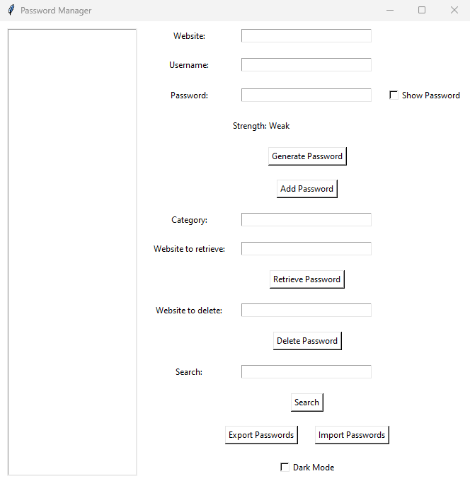

# Password Manager

A secure and user-friendly password manager built using Python and Tkinter. This application allows users to store, retrieve, 
and manage their passwords securely, with additional support for two-factor authentication (2FA) using TOTP.

## Features

- Secure storage of passwords using encryption.
- User registration and authentication with a master password.
- Two-factor authentication (2FA) using TOTP.
- Password generation and strength evaluation.
- Export and import passwords in CSV format.
- Search for stored passwords.
- Dark mode support.

## Security

- Passwords are encrypted using the `cryptography` library.
- User authentication is handled with hashed passwords.
- Two-factor authentication (2FA) is implemented using the `pyotp` library.
